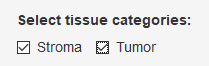
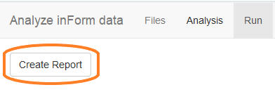

```{r setup, include = FALSE}
knitr::opts_chunk$set(
  collapse = TRUE,
  comment = "#>"
)
```

## Analysis overview

A `phenoptrReports` analysis aggregates cell phenotypes and marker expression
for each slide and tissue category in an experiment. An 
analysis can aggregate phenoype counts, density, 
mean expression and H-Score.

There are three parts to creating an analysis: 

- select the input files
- define the desired analysis
- create the final reports

## Detailed steps

### Start the analysis app

Choose "Analyze consolidated data" from the RStudio Addins menu 
to open the analysis app.


### Select input files

The first tab in the analysis app is Files. Use this tab to select the
input files and output directory for your analysis.

1. First, click the first Browse... button to select the consolidated data file created in the consolidation app. This is the most important input file
and the only one that is required. 

2. Next, click the second Browse... button. Select a directory to contain
the results of the analysis.

3. To include cell densities in the analysis, click the third Browse... button and 
select a merged summary cell seg data file. The summary cell seg file includes
information about tissue category area which is needed by the density 
calculation.

4. If your analysis includes H-Score, click the last Browse... button to select
a score data file. The analysis will use the thresholds and markers in
the score file to compute H-Score for each slide in the experiment.


### Define the analysis

The second tab in the analysis app is Analysis. It contains sections
where you select tissue categories, phenotypes, and markers of 
interest.

#### Tissue categories

In this section, select the tissue categories to include in the analysis.



#### Slide ID prefix

The Slide IDs in your data file may contain prefix information that is not
wanted in the final report. Any text you enter here will be removed from 
the start of the Slide IDs. The text can be either an exact match or a
[regular expression](http://r4ds.had.co.nz/strings.html#matching-patterns-with-regular-expressions). In either case it will match from the start of the Slide ID.

Leave this field blank to use the existing Slide IDs unchanged.


#### Define phenotypes and markers

In this section you define the phenotypes and markers of interest.
Every phenotype defined in this section will be included in the Cell Counts,
Cell Percents and Cell Density sections of the final report. Phenotypes for
which you select an expression marker will also be included in the 
Mean Expression section of the report.

The available phenotypes are shown at the top of the section. These are the  phenotype names you can use in your phenotype definitions.

In the "Phenotype" box, enter the definition of a phenotype of interest.
You can enter a single or multiple phenotype. 

To analyze a single phenotype, enter the phenotype name with a
 + or -, for example CD3+ or CD8-.

To analyze a multiple phenotype, combine individual phenotype definitions
with slash (/) or comma (,). Combine with a slash to define double positive phenotypes, for example CD3+/CD8+. Combine with a comma to allow either
phenotype, for example CD68+,CD163+.

To compute mean expression of a marker for a phenotype, select 
the marker of interest in the Expression drop-down.

To compute expression of multiple markers for a single phenotype,
add a duplicate phenotype with the second marker selected. To
compute expression of a marker for all cells, enter "Total Cells"
as the phenotype.


### Create reports

The final tab in the analysis app is the Run tab. Click "Create Report"
to run the displayed R script to create the final reports. Wait for 
the script to run; when it is finished, the app will close.

The script computes aggregated statistics, writes them to an Excel
workbook, and creates visualizations of the results in a Word document. The 
R script is saved in the output directory and may be inspected, modified
or re-run if needed.


