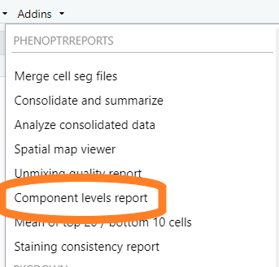
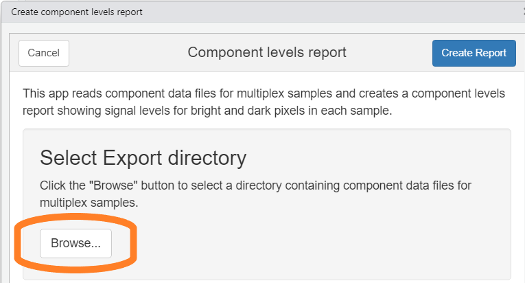
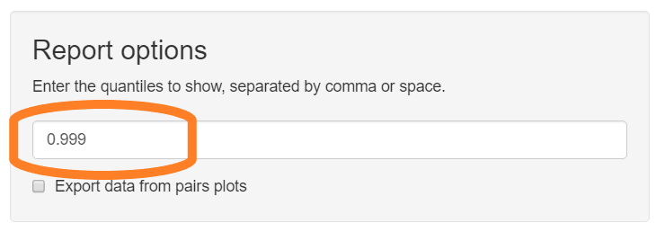
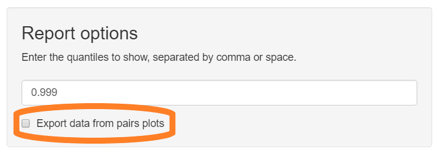
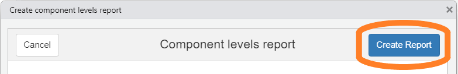

  ```{r setup, include = FALSE}
knitr::opts_chunk$set(
  echo=FALSE,
  collapse = TRUE,
  comment = "#>"
)
```

The component levels report analyzes unmixed, multiplex images
to help evaluate staining and unmixing quality. This report
shows the relative strength of each component and
crosstalk between components.

## Data requirements

The input to this report is an inForm export directory containing
multiplex images
which have been unmixed by inForm using a candidate spectral library.

Multiplex images are taken from slides stained with a multiple fluorophores
and a counterstain. The export directory
should contain component data files from
one or more images in the experiment.

## Detailed steps

#### Choose "Component levels report" from the RStudio Addins menu

This will open the component levels report app.

```{r, fig.alt = "Image showing RStudio Addin menu", out.width="40%"}

```

#### Select input files  

Click the "Browse" button in the "Select Export directory" section of 
the GUI. Use the directory selection dialog to select the directory containing
exported component data files.

```{r, fig.alt = "Image highlighting the Browse button", out.width="75%"}

```

#### Enter the quantiles of interest

The component levels report shows the pixel intensity of each fluor in each
image. Selected quantiles are shown with black bars and
exported in CSV files. Enter the fractions corresponding to the quantiles of 
interest. The default value, 0.99, will show the signal level that is 
greater than 99% of the pixels in each image. This is a reasonable measure
of peak signal intensity.

Enter the desired quantiles in the text field. Multiple values can be entered,
separated by comma or space.

```{r, fig.alt = "Image showing the entry field for desired quantiles", out.width="75%"}

```

#### Select export option

The component levels report includes "pairs plots" showing the expression
levels of each component against each other component. These can help
identify problematic crosstalk. Check the box "Export data from pairs plots"
to have the report include text files containing the raw data for the plots.

```{r, fig.alt = "Image showing Export data checkbox", out.width="75%"}

```

#### Create report

Click "Create Report" to begin generating the report. The app will create
an HTML file containing the analysis results and and two CSV files
containing values from the report.

```{r, fig.alt = "Image showing Create Report button", out.width="75%"}

```
