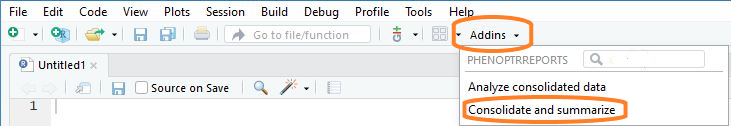
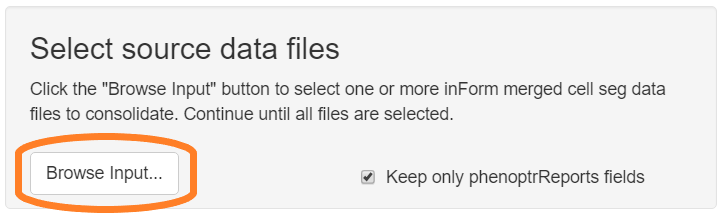
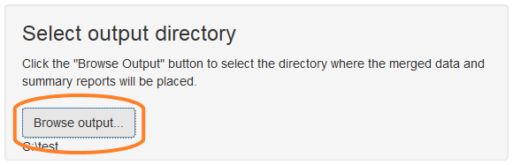
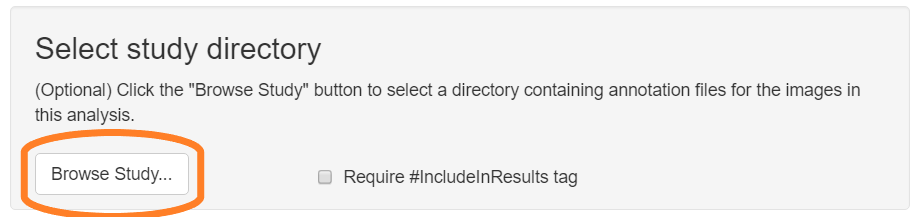
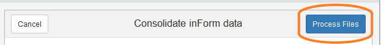
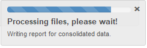

```{r setup, include = FALSE}
knitr::opts_chunk$set(
  collapse = TRUE,
  comment = "#>"
)
```

## Data consolidation overview

The first step in a `phenoptrReports` data analysis is data consolidation.

The consolidation step combines the output from multiple inForm projects into a 
single consolidated data file and creates columns for each individual
phenotype. The inputs to this step are merged cell seg data files from
multiple inForm projects. The output is a consolidated data file and a
summary report for each file. 

Optionally, this step includes, excludes and tags cells according to
regions of interest created in Phenochart.

NOTE: The consolidation step will fail if 
the Slide IDs and Cell IDs in the merge files do not exactly agree. This can
happen, for example, if

- the projects use different cell segmentation parameters
- different fields were included in the merge step
- a region of interest or disinterest was drawn in the merge step

Run the consolidation step even if your data comes from a single
inForm project. This creates a data file in the format that the analysis
step uses.

## Data requirements

#### Merged cell seg data

The primary source data for `phenoptrReports` is 
one or more merged cell seg data files created in the inForm Review/Merge tab.
You may use multiple merge files from multiple inForm projects with different 
phenotypes. The Slide ID and Cell ID fields in multiple merge files 
must agree exactly. 

#### Tissue segmentation

inForm projects used with `phenoptrReports` must include a tissue 
segmentation step.

#### Phenotypes

The names of positive phenotypes used with `phenoptrReports` must end
with "+", for example "CD8+" or "FoxP3+". Negative and "Other"
phenotype names should not end in "+".

#### Tagged regions

Tagged regions are read from annotation files created in Phenochart. To
process tagged regions, these files must be available to the 
consolidation app. 

## Detailed steps

#### Choose "Consolidate and summarize" from the RStudio Addins menu

Thus will open the consolidation app.



#### Select input files  

Click the "Browse Input" button in the "Select merge data files" section of 
the GUI. Use the file selection dialog to select your inForm merge data files.
If the files are in multiple directories, click the Browse button multiple
times to select them.
  


#### Select output directory

Click the "Browse Output" button in the "Select output directory" section of
the GUI. Use the directory selection dialog to create a new directory to
contain the output files.



#### Select study directory (optional)

To process tagged annotation regions as part of the consolidation,
click the "Browse Study" button and select a study directory 
(or other directory) containing the annotation files for the images in the
current project.

If a study directory is selected,

- Cells in regions tagged `#ExcludeFromResults` will be omitted from
  the consolidated data.
- If "Require #IncludeInResults tag" is checked, cells that **are not**
  in regions tagged `#IncludeInResults` will be omitted from the 
  consolidated data.
- If there are tagged annotations with other names, new columns will be 
  created in the consolidated data showing membership in the tagged regions.



#### Process files

Click the "Process Files" button to start processing of the selected files. 



A small progress meter will open to show progress. Any errors will be shown
in the RStudio Console pane.



#### View summary reports

When processing completes, the output directory will contain
several files:

- `Consolidated_data.txt` - A data file containing the consolidated results
- `Consolidated_data.html` - A report containing summary information about
  the consolidated data
- `ROI_Results.xlsx` - If a study directory was selected, this file
  reports the number of cells excluded or tagged in each image.
- Summary reports for each merge file that contributed to the result

The consolidated data file is used for the actual analysis. The summary reports
contain an overview of the data, including

- number of fields per slide
- number of cells of each phenotype per slide
- visualizations of the combination phenotypes present in the data

#### Next: Analysis

Continue to the 
[next tutorial](analysis.html)
to learn how to complete your analysis.
