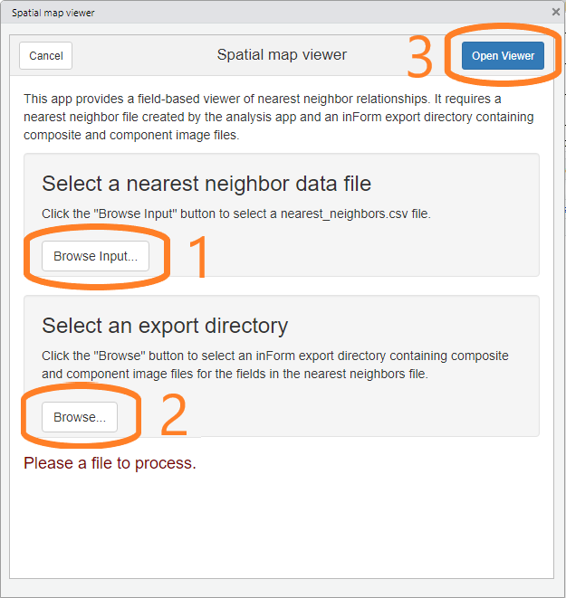
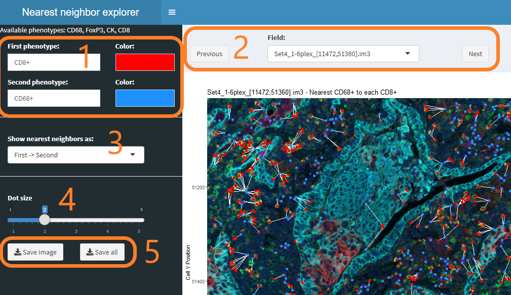

```{r, include = FALSE}
knitr::opts_chunk$set(
  collapse = TRUE,
  comment = "#>"
)
```

## Overview

The "Spatial map viewer" addin allows viewing of nearest neighbor relationships
between cells of selected phenotypes in a single field. Views can be saved
for later use.

## Data requirements

### Consolidated data file

This addin requires reads data from the `Consolidated_data.txt` file created
by the "Consolidate and summarize" addin. 
It can also use the `nearest_neighbors.csv` file
created by the "Analyze consolidated data" addin when 
"Save nearest neighbor details" is selected.

### Composite and component image files

The viewer uses both composite and component image files for the fields of
interest. These files are written by the inForm export step.

The composite images are shown as the background of the nearest neighbor
visualizations. The colors and components shown are determined by the
inForm export settings.

The component images are the source of metadata about fields that is needed
to properly places cells in the visualizations.

## Detailed steps

### Start the spatial map viewer

Choose "Spatial map viewer" from the RStudio Addins menu to start the 
viewer.

### Select input files

The viewer's initial screen allows you to select the nearest neighbor 
file and inForm export directory containing the fields of interest.

1. First, click the "Browse input" button and select the `nearest_neighbors.csv`
file created by the analysis addin.

2. Next, click the second "Browse" button and select the inForm output directory
corresponding with the nearest neighbors file.

3. Finally, click "Open Viewer" to start the viewer.



### Nearest neighbor viewer

The nearest neighbor viewer allows you to 

1. **Select and color phenotypes**
In this section, select the two phenotypes of interest and the colors
to use to display the phenotypes. Both single phenotypes such as `CD8+`
and multiple phenotypes such as `CD8+/PDL1+` are supported.

2. **Select a field to view**
Use the dropdown to select a particular field, or use the Previous
and Next buttons to browse through all the fields.

3. **Select the type of nearest neighbor relationship**
"Nearest neighbor" is not
a symmetric relationship---cell A may have a nearest neighbor B, whose nearest
neighbor is not A. Try the different settings to find the one you want.

4. **Control the dot size**
This slider controls the size of the dots displaying the cells. You may
want to make the dots smaller before saving images.

5. **Save a single view or views for all fields**
The "Save image" button will save the currently displayed image in your 
browser's Download folder. The "Save all" button will use the current settings
to save a zip file containing images of all fields in the experiment.


