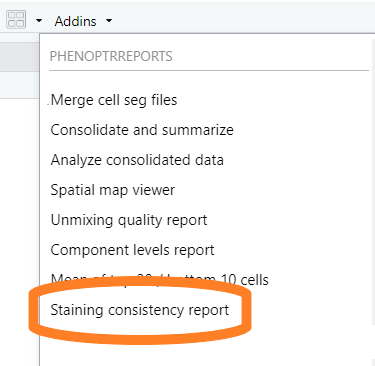
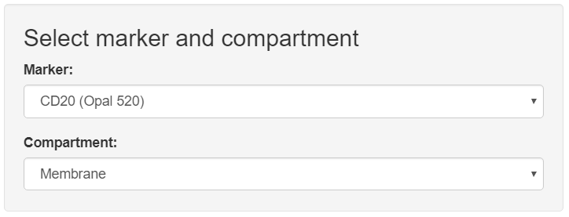
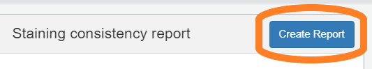
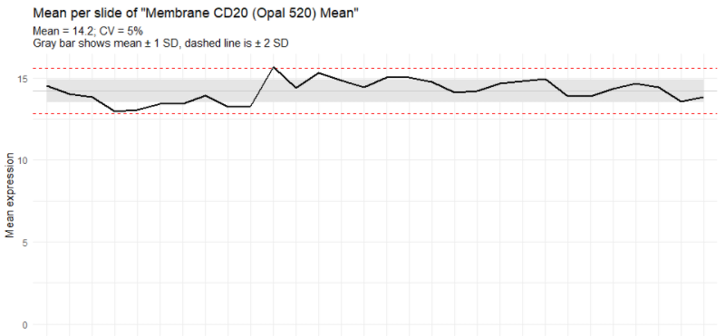
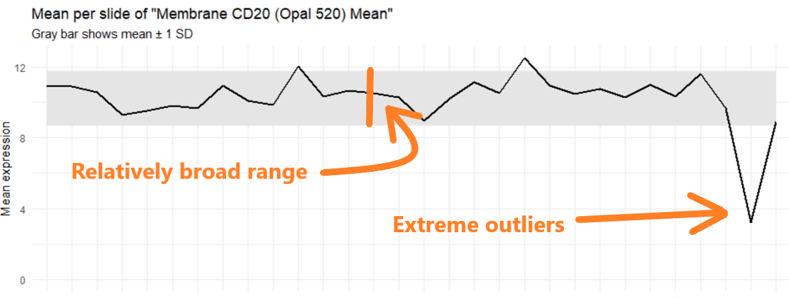

```{r setup, include = FALSE}
knitr::opts_chunk$set(
  echo=FALSE,
  collapse = TRUE,
  comment = "#>"
)
```

The staining consistency report measures variation in the mean expression
of a single marker across multiple images. It is used to assess consistency
of staining within or across staining runs.

When analyzing slides from a single staining run, this report 
can highlight inconsistent staining and suggest that autostainer maintenance
is needed.

When analyzing slides from multiple runs of an assay, the report can
indicate changes in assay performance over time.

## Data requirements

The input to this report is a merged cell seg data file from inForm
containing data about the samples to measure.

## Detailed steps

#### Choose "Staining consistency report" from the RStudio Addins menu

This will open the app.

```{r, fig.alt = "Image showing RStudio Addin menu", out.width="40%"}

```


#### Select merge file

Click the "Browse" button in the "Select Merge Data" section of the GUI. 
Use the file selection dialog to select the file containing your merge data.

```{r, fig.alt = "Image highlighting the Browse button", out.width="60%"}

```

#### Select marker and compartment

Select the marker and cell compartment for the report from the 
drop-down menus.

```{r, fig.alt = "Image showing selection of marker and compartment", out.width="50%"}

```

#### Create report

Click "Create Report" to begin generating the report. The app will create
an HTML document with the results.

```{r, fig.alt = "Image showing Create Report button", out.width="50%"}

```

## Guidance

#### Good result

In general, a good result will have a relatively narrow range of mean values, 
limited outliers beyond the &plusmn;1 SD range, and a CV less than 15%.
<br><br>

```{r, fig.alt = "Image showing good results", out.width="75%"}

```

#### Problem indications

A wide range of mean values, outliers far outside the &plusmn;1 SD range,
or CV greater than 15% indicates a possible problem.

If the slides are from a single staining run, the
autostainer may need maintenance.

If the slides are from multiple runs, the variation may be due to 
one of these causes:

* assay performance is drifting or has drifted
* a new reagent or lot # of reagent placed into service is not performing
* a run or slide failure has occurred through operator error
<br><br>

```{r, fig.alt = "Image showing bad results", out.width="75%"}

```


This analysis assumes that assay performance has been monitored over 
time under the same operating conditions, as much as is practicable.
