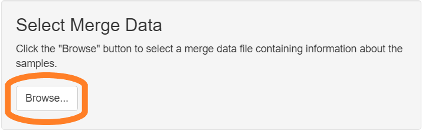

```{r setup, include = FALSE}
knitr::opts_chunk$set(
  echo=FALSE,
  collapse = TRUE,
  comment = "#>"
)
```

The staining consistency report measures variation in the mean expression
of a single marker across multiple images. It is used to assess consistency
of staining across multiple staining runs.

## Data requirements

The input to this report is a merged cell seg data file from inForm
containing data about the samples to measure.

## Detailed steps

#### Choose "Staining consistency report" from the RStudio Addins menu

This will open the app.

```{r, fig.alt = "Image showing RStudio Addin menu", out.width="40%"}
knitr::include_graphics("figures/Staining_consistency_addin.png")
```


#### Select merge file

Click the "Browse" button in the "Select Merge Data" section of the GUI. 
Use the file selection dialog to select the file containing your merge data.

```{r, fig.alt = "Image highlighting the Browse button", out.width="60%"}

```

#### Select marker and compartment

Select the marker and cell compartment for the report from the 
drop-down menus.

```{r, fig.alt = "Image showing selection of marker and compartment", out.width="50%"}

```

#### Create report

Click "Create Report" to begin generating the report. The app will create
an HTML document with the results.

```{r, fig.alt = "Image showing Create Report button", out.width="50%"}

```

