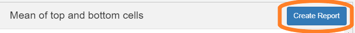

```{r setup, include = FALSE}
knitr::opts_chunk$set(
  echo=FALSE,
  collapse = TRUE,
  comment = "#>"
)
```

The top 20 / bottom 10 report computes the mean expression of selected
markers in the 20 highest-expressing cells and the 10% lowest-expressing
cells. The resulting Excel workbook has tabs showing

- **Top 20 data** Mean expression of high-expressing cells for each marker.
- **Bottom 10%ile data** Mean expression of low-expressing cells for each marker.
- **Ratio top to bottom** Ratio of high-to-low expression for each marker. If Opal 780 is 
  one marker, high-to-low ratios less than 30 are highlighted.
- **Ratio adjacent fluors** Ratio of high-to-high expression for adjacent markers, highlighting
  ratios that exceed a provided range.

## Data requirements

The input to this report is a merged cell seg data file from inForm
containing data about the samples to measure, and a configuration
file naming the markers of interest.

### Configuration file

The configuration file must contain the names of the columns to
measure, one name per line, without the units information. For example, a 
configuration file might have these contents:

```
Nucleus DAPI Mean
Membrane CD8 (Opal 480) Mean
Membrane PDL1 (Opal 520) Mean
Nucleus Ki67 (Opal 570) Mean
Cytoplasm CD68 (Opal 620) Mean
Membrane CK (Opal 690) Mean
Membrane PD1 (Opal 780) Mean
```

The order of entries in the configuration file determines which markers
will be compared as adjacent markers in the report.

## Detailed steps

#### Choose "Mean of top 20 / bottom 10 cells" from the RStudio Addins menu

This will open the app.

```{r, fig.alt = "Image showing RStudio Addin menu", out.width="40%"}
knitr::include_graphics("figures/Top_20_bottom_10_addin.png")
```


#### Select merge file

Click the "Browse" button in the "Select Merge Data" section of the GUI. 
Use the file selection dialog to select the file containing your merge data.

```{r, fig.alt = "Image highlighting the first Browse button", out.width="75%"}
knitr::include_graphics("figures/Top_20_bottom_10_browse_merge.png")
```

#### Select merge file options

If the merge file contains tissue category data, select the tissue categories to analyze.

```{r, fig.alt = "Image showing tissue category selection", out.width="40%"}
knitr::include_graphics("figures/Top_20_bottom_10_tissue_categories.png")
```

You can report by slide or by field. Make the appropriate selection in the
"Summarize by" drop-down.

```{r, fig.alt = "Image showing Summarize by selection", out.width="40%"}
knitr::include_graphics("figures/Top_20_bottom_10_summarize_by.png")
```

#### Select a configuration file

Click the "Browse" button

```{r, fig.alt = "Image highlighting the second Browse button", out.width="75%"}
knitr::include_graphics("figures/Top_20_bottom_10_browse_config.png")
```

#### Set the ratio limit

Set the desired maximum ration of high expression in adjacent fluors. Ratios
larger than this will be highlighted in the generated report.

```{r, fig.alt = "Image of numeric entry field for maximum ratio", out.width="40%"}
knitr::include_graphics("figures/Top_20_bottom_10_max_ratio.png")
```

#### Create report

Click "Create Report" to begin generating the report. The app will create
an Excel workbook with the numerical analysis results and a Word document with
charts which visualize the results.

```{r, fig.alt = "Image showing Create Report button", out.width="75%"}

```


