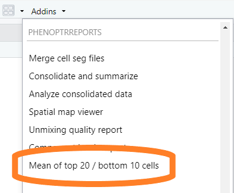
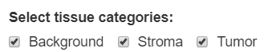
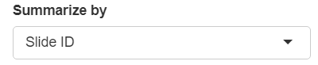
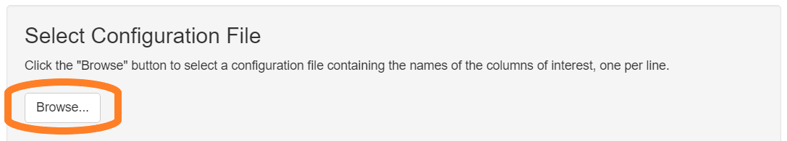
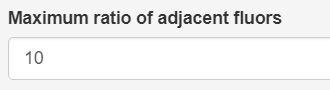

```{r setup, include = FALSE}
knitr::opts_chunk$set(
  echo=FALSE,
  collapse = TRUE,
  comment = "#>"
)
```

## Introduction

The “Mean of Top 20/ bottom 10” analysis is performed on multiplexed fluorescent
IHC images. The analysis helps to evaluate whether the staining quality is
likely to produce good unmixing of the markers in the image. The analysis
computes the mean expression of selected markers in the 20 highest-expressing
cells and the 10% lowest-expressing cells. The resulting Excel workbook has tabs
showing

- **Top 20 data** Mean expression of high-expressing cells for each marker.
- **Bottom 10%ile data** Mean expression of low-expressing cells 
  for each marker, estimating background signal levels.
- **Ratio top to bottom** Ratio of high-to-low expression for each marker,
  estimating the signal-to-background ratio. 
- **Ratio adjacent fluors** Ratio of high-to-high expression for adjacent 
  markers, highlighting ratios that exceed a specified range.

Generally, the best unmixing results are obtained when the expression levels of
all fluors (excluding DAPI) are within the range of 10-30 normalized counts.
Most importantly, the ratio between neighboring fluors  should fall between
0.3-3 for multispectral IM3 images or 0.1-10 for MOTiF images. When one fluor is
3x/10x (IM3/MOTiF) brighter than its neighboring fluor, unmixing error and
crosstalk are more likely to occur.

The signal-to-background value helps to assess background levels in relation to
real, positive signal. When higher background is present, resulting in a lower
signal-to-background ratio, cell scoring based on thresholding will be less
reliable and will likely result in more false positives. Phenotyping may also be
more challenging. The app is will flag signal-to-background values of 30 or less
within the Opal 780 channel as this fluor tends to have lower intensities with
higher background levels.

## Data requirements

The input to this report is a merged cell seg data file from inForm
containing data about the samples to measure, and a configuration
file naming the markers of interest.

### Configuration file

The configuration file is a plain text file (`.txt`). It contains the names
of the columns to
measure, one name per line, without the units information. For example, a 
configuration file might have these contents:

```
Nucleus DAPI Mean
Membrane CD8 (Opal 480) Mean
Membrane PDL1 (Opal 520) Mean
Nucleus Ki67 (Opal 570) Mean
Cytoplasm CD68 (Opal 620) Mean
Membrane CK (Opal 690) Mean
Membrane PD1 (Opal 780) Mean
```

The order of entries in the configuration file determines which markers
will be compared as adjacent markers in the report.

## Detailed steps

#### Choose "Mean of top 20 / bottom 10 cells" from the RStudio Addins menu

This will open the app.

```{r, fig.alt = "Image showing RStudio Addin menu", out.width="40%"}

```


#### Select merge file

Click the "Browse" button in the "Select Merge Data" section of the GUI. 
Use the file selection dialog to select the file containing your merge data.

```{r, fig.alt = "Image highlighting the first Browse button", out.width="75%"}

```

#### Select merge file options

If the merge file contains tissue category data, select the tissue categories to analyze.

```{r, fig.alt = "Image showing tissue category selection", out.width="40%"}

```

You can report by slide or by field. Make the appropriate selection in the
"Summarize by" drop-down.

```{r, fig.alt = "Image showing Summarize by selection", out.width="40%"}

```

#### Select a configuration file

Click the "Browse" button

```{r, fig.alt = "Image highlighting the second Browse button", out.width="75%"}

```

#### Set the ratio limit

Set the desired maximum ration of high expression in adjacent fluors. Ratios
larger than this will be highlighted in the generated report.

Recommended values are 10 for MOTiF images and 3 for multispectral IM3 images.

```{r, fig.alt = "Image of numeric entry field for maximum ratio", out.width="40%"}

```

#### Create report

Click "Create Report" to begin generating the report. The app will create
an Excel workbook with the numerical analysis results and a Word document with
charts which visualize the results.

```{r, fig.alt = "Image showing Create Report button", out.width="75%"}

```

## Guidelines

This table gives some general guidelines for interpreting the results.

<table>
<tr><th style="width:150px; text-align: left">Worksheet Tab</th>
<th style="text-align: left">Guidelines</th></tr>

<tr><td style="vertical-align: top">Top 20 data</td><td>
Optimal signal intensity for unmixing is typically between 10-30 for all fluors
except Opal 780, which should be at least between 1-10.
<br><br>
Reliable data can still be obtained when signals are as low as a few counts 
or as high as 50 or more counts, but risks are higher for crosstalk issues.
</td></tr>

<tr><td style="vertical-align: top">Bottom 10%ile data</td><td>
Optimal background for unmixing is less than 10. Values greater than 10 are 
indicative of background staining.
<br><br>
Higher DAPI intensities are OK since all cells will be expressing DAPI,
meaning this value is a measure of the lowest real signals and not truly
background.</td></tr>

<tr><td style="vertical-align: top">Ratio top to bottom</td><td>
The signal-to-background value helps to assess background levels in
relation to real, positive signal.
<br><br>
Optimal ratios for top to bottom are values greater than 20. Values much greater
than 20 are common. “#NUM” indicates zero background.
<br><br>
When higher background is present, resulting in a lower signal-to-background
ratio, cell scoring based on thresholding will be less reliable
and will likely result in more false positives.
<br><br>
For the Opal 780 channel, the report will flag signal-to-background
values of 30 or less as this fluor tends to have lower intensities
with higher background levels.
<br><br>
For DAPI, low numbers can indicate that bottom expressors are high,
which is OK as this is not truly a signal-to-background assessment but is a
ratio of high to low expressing cells.</td></tr>

<tr><td style="vertical-align: top">Ratio adjacent fluors</td><td>
Optimal ratios for adjacent fluors are between 0.3-3 or 0.1-10 for IM3 and
MOTiF images, respectively.
<br><br>
Values below or above these ranges indicate the potential of a fluor
bleeding into a neighboring fluor.
<br><br>
When one fluor is greater than 3x (IM3) or 10x (MOTiF) brighter than its
neighboring fluor, unmixing error and crosstalk are more likely to occur.
</td></tr></table>


