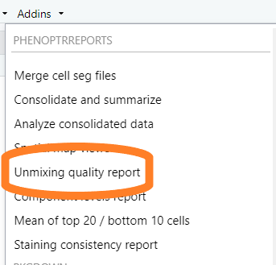

```{r setup, include = FALSE}
knitr::opts_chunk$set(
  collapse = TRUE,
  comment = "#>"
)
```

The unmixing quality report analyzes unmixed, singleplex images
to help evaluate staining and unmixing quality. This report
shows crosstalk between components and
highlights potential problem areas in assay development.

## Data requirements

The input to this report is an inForm export directory containing
singleplex images
which have been unmixed by inForm using a candidate spectral library.

Singleplex images are taken from slides stained with a single fluorophore
and no counterstain (except on the DAPI singleplex). The export directory
should contain component data files from
one or more images for each fluor in the experiment.

The report generator must identify the Opal fluor for each source file by
looking at the file name. It recognizes names containing
"DAPI", "AF", "Opalnnn" and "Opal_nnn". 
It also recognizes three leading digits as the number of an Opal fluor.


## Detailed steps

#### Choose "Unmixing quality report" from the RStudio Addins menu

This will open the quality reporting app.



#### Select input files  

Click the "Browse" button in the "Select Export directory" section of 
the GUI. Use the directory selection dialog to select the directory containing
exported component data files.
  


#### Create report

Click the "Create Report" button to start processing of the selected directory. 


When the report is complete, the app window will close. Any errors will be
reported in the RStudio Console pane.

#### View the report

When processing completes, the export directory will contain
a file `Unmixing_quality_report.html` which may be viewed in any web browser.
